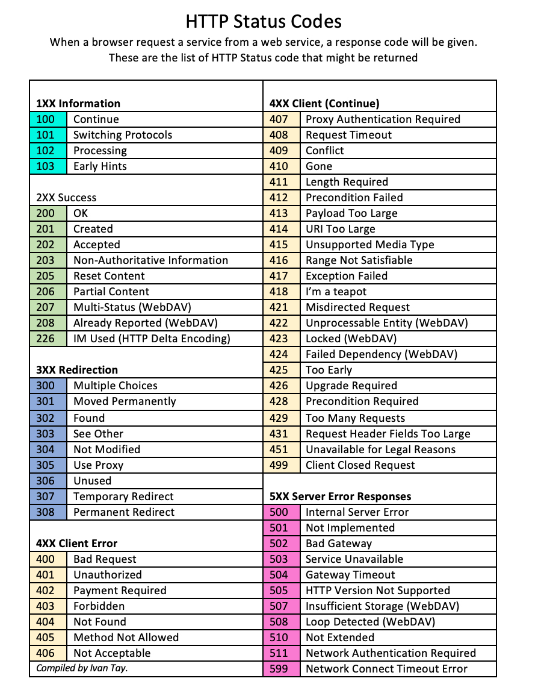
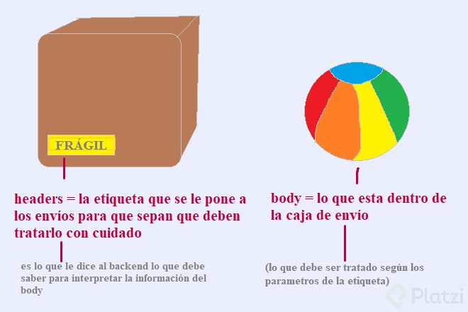

# Que es una API REST

Las API son Interfaces de Programación de Aplicaciones, simplifican el desarrollo de aplicaciones al permitir que estas intercambien datos y funcionalidades de una forma fácil y segura.

Así es como funciona una API:

Una aplicación cliente inicia una llamada a la API para recuperar información, también conocida como solicitud(Request).
Esta solicitud se procesa desde una aplicación al servidor web a través del Identificador de Recursos Uniforme (URI) de la API e incluyen un verbo de petición como GET, POST, PUT o DEL, encabezados(headers), y a veces un cuerpo de petición(body).
Después de recibir una solicitud válida, la API hace un llamado a un programa externo o un servidor web.
El servidor envía una respuesta (Response) a la API con la información solicitada.
La API transfiere los datos a la aplicación solicitante inicial.
Soap es con XHR = XMLHttpResponse y aun algunas apps lo usan.
La transferencia de estado representacional (REST) es una arquitectura de software que impone condiciones sobre cómo debe funcionar una API. En un principio, REST se creó como una guía para administrar la comunicación en una red compleja como Internet. Es posible utilizar una arquitectura basada en REST para admitir comunicaciones confiables y de alto rendimiento a escala. Puede implementarla y modificarla fácilmente, lo que brinda visibilidad y portabilidad entre plataformas a cualquier sistema de API.
También, REST no solo retorna la información en JSON, JSON es lo más usual pero también lo puede retornar en XML y en texto plano.

Server Side Rendering (SSR) es el flujo de comunicación entre frontend y backend (servidor), el usuario a través de un navegador web hace una petición a un servidor y este devuelve una respuesta en html (carga completa de una página web)
Single Page Application (SPA) es el flujo de comunicación entre frontend y backend que se da gracias a JS, con el cual podemos manipular el DOM sin tener que cargar la página completa, el usuario hace una petición al backend (API) a través de una API REST, la API consulta a una base de datos y obtiene una respuesta, esta regresa en formato JSON y es insertada al html modificando el DOM.

HTTP status codes
    1XX Respuestas Afirmativas
    2XX Respuestas satisfactorias
    3XX Re-direcciones
    4XX Error del cliente
    5XX Error de servidor

API KEY
Son una, no la única, de las formas en que el backend puede identificar quien está haciendo cada solicitud.

Debemos entender dos conceptos importantes, la Autenticación y la Autorización.

Autenticación
Consiste en identificar quien es cada quien. No sabe que permisos tiene fulano, No sabe que puede o no hacer fulano, Solamente sabe que él es fulano, que ella es pamela o que esa es una persona sin identificar.

Autorización
Es la que nos dice que permisos tiene cada quien, es decir, si fulano quiere ir a la nevera para comerse un pastel, es la que dice, espérate fulano, tienes permisos para abrir la nevera?, a listo ábrela, tienes permisos de comerte el pastel?, a bueno comételo.

Y además por poner un ejemplo más real, si fulano trata de ver las fotos privadas de pamela, la autorización va a decir, ok quien eres?, la autenticación ya te dijo que eras fulano, a listo perfecto, autenticación me pasas un token, listo ya sé que tu eres fulano, y luego empieza a revisar los permisos, como no los tiene se lo va a prohibir,

Obviamente estos trabajan en conjunto para prohibir o permitir a toda la información que tenemos en nuestra aplicación, y ahí es donde entran las API KEYs.

Estas API Keys son una de las formas en que el backend puede indentificar quien es cada quien.

El backend necesita saber quien esta haciendo cada solicitud, para proteger la información privada de las personas, pero también en muchos casos, para limitar la cantidad o las solicitudes que le hacemos a la aplicación.

Para que nosotros podamos enviarle esta API KEY en cada solicitud que hagamos al backend podemos utilizar varias formas:

Query parameter: ?apy_key=ABC123
Authorization Header: X-API-Key: ABC123
Alternativas
Authorization: Basic
Authorization: Barer Token
OAuth 2.0 (es de las mejores y más complicadas formas de autenticar en la modernidad)
Access Key + Secret Key
En este caso estamos haciendo una Application-based authentication es decir estamos autenticando nuestra aplicación, estamos autenticando a nuestro frontend para que pueda hacer solicitudes al backend, pero hay aplicaciones donde no solamente necesitamos una Application-based authentication, también hay apps que necesitamos usar esta con una User-based authentication.

Un protocolo especifica reglas en la comunicación entre dos entes, en este caso entre dos computadoras.

HTTP (Hyper Text Transfer Protocol) fue creado específicamente para la web.

Verbos
Una de las cosas que especifica el protocolo HTTP son los verbos:

GET: solicitar datos o algún recurso.
HEAD: traer headers (como una peticion GET pero sin contenidos). Es util cuando vamos a utilizar APIs, para comprobar si lo que vamos a enviar esta correcto y puede ser procesado.
POST: enviar datos a un recurso para la creación.
PUT: reemplazar por completo un recurso.
PATCH: reemplazar parcialmente un recurso.
DELETE: eliminar un recurso.

